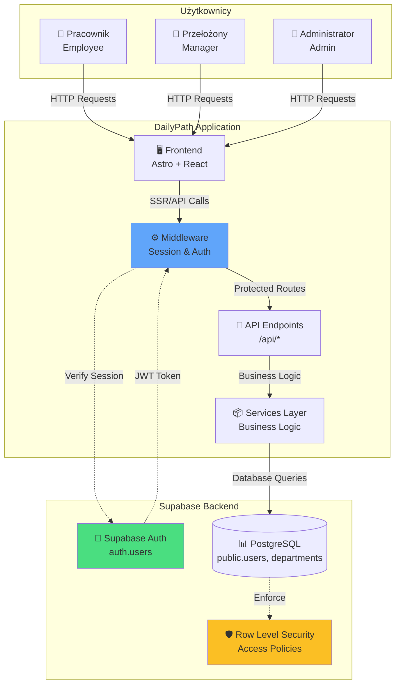
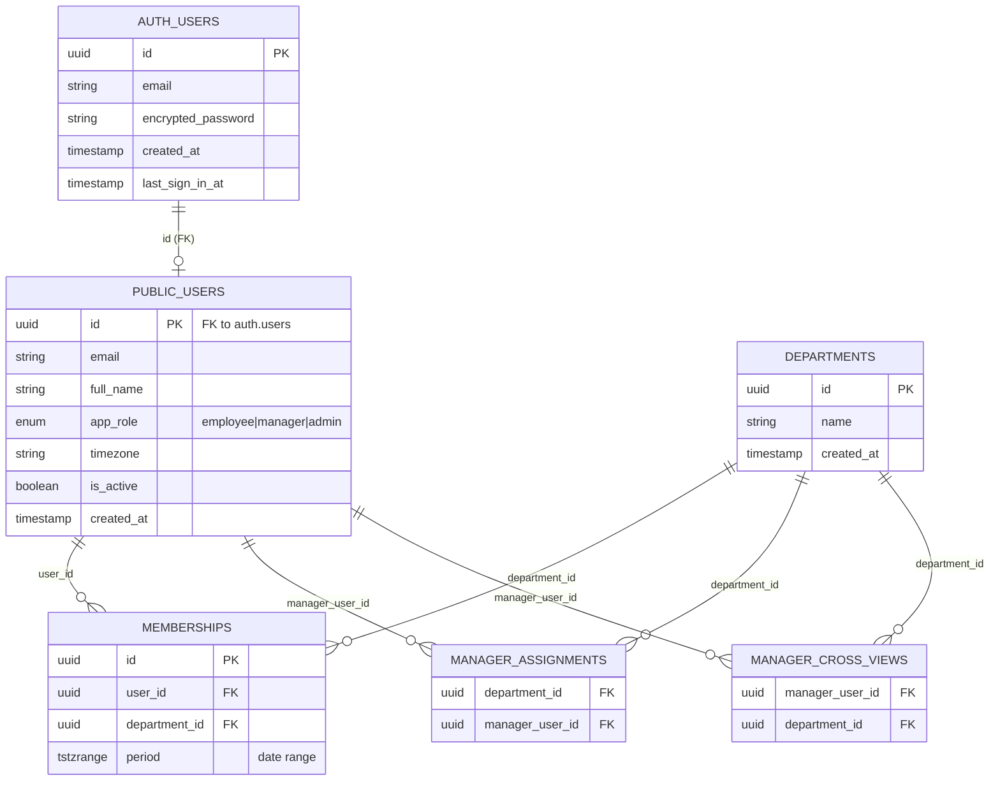
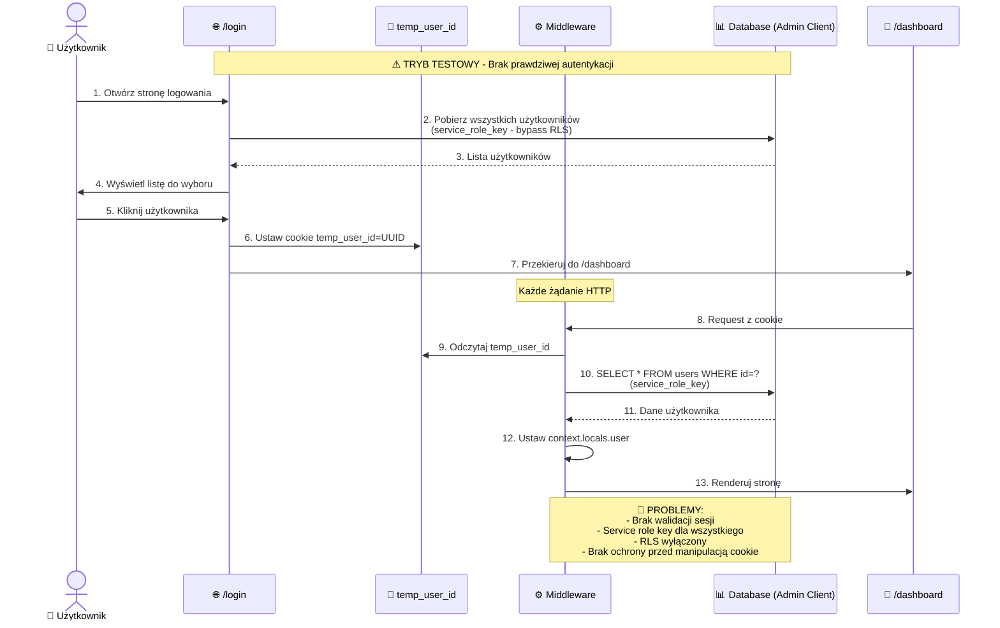
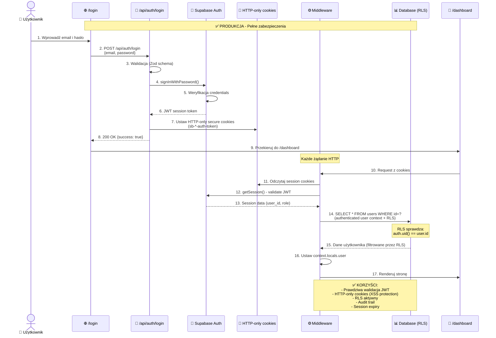
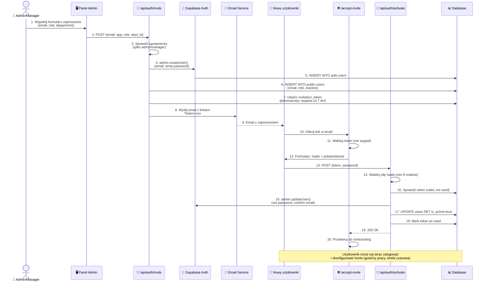
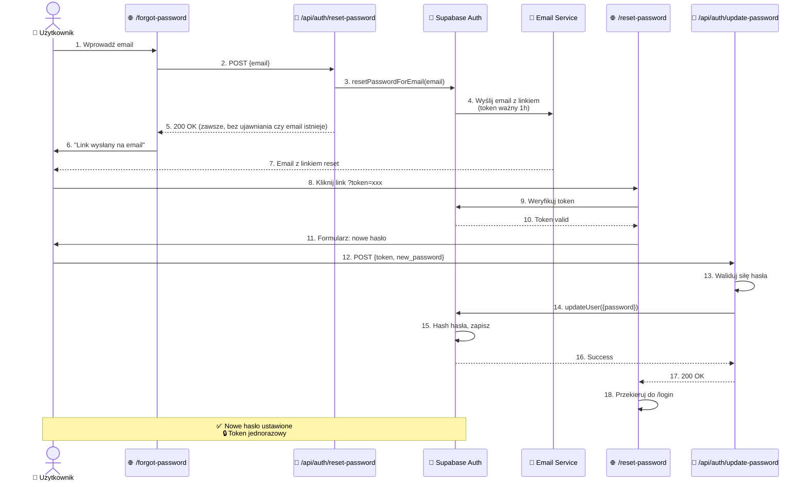
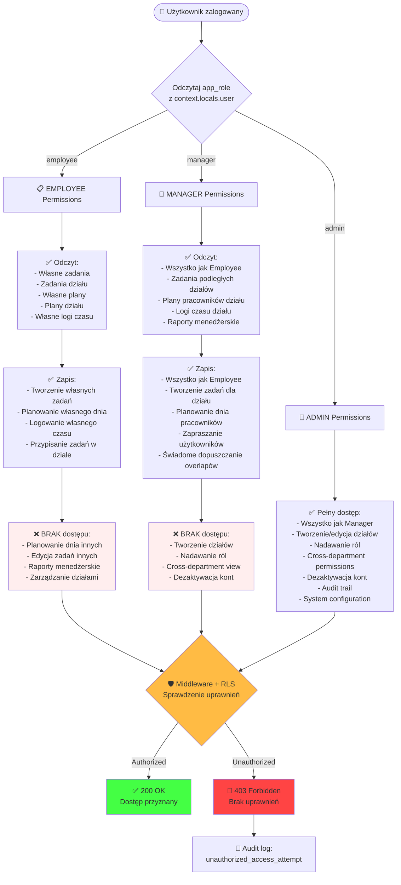
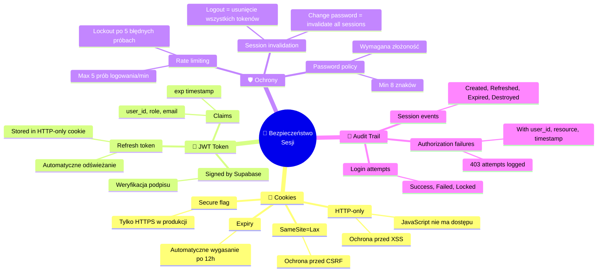
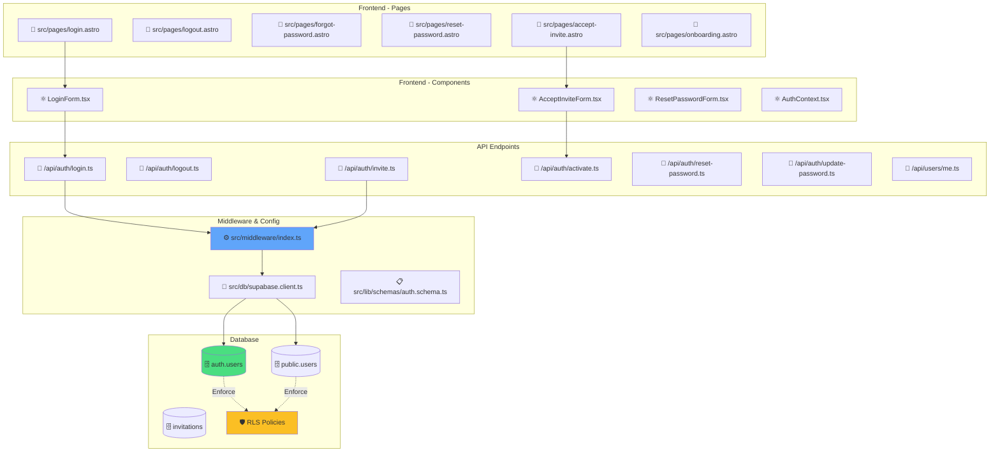

# Diagram architektury autentykacji - DailyPath

## 1. Architektura wysokiego poziomu (C4 Context)



## 2. Schemat bazy danych - tabele autentykacji



## 3. Stan obecny (TEMPORARY) vs Stan docelowy

### 3.1 STAN OBECNY - Tymczasowa autentykacja



### 3.2 STAN DOCELOWY - Pełna autentykacja Supabase



## 4. Przepływ rejestracji przez zaproszenie (US-001, US-010)



## 5. Przepływ resetowania hasła (US-003)



## 6. Autoryzacja oparta na rolach (US-005)



## 7. Middleware - Przepływ walidacji sesji

```mermaid
flowchart TD
    START([🌐 HTTP Request]) --> CREATE_CLIENT[Utwórz Supabase Client<br/>z dostępem do cookies]
    
    CREATE_CLIENT --> GET_SESSION[getSession()<br/>z HTTP-only cookies]
    
    GET_SESSION --> HAS_SESSION{Czy sesja<br/>istnieje?}
    
    HAS_SESSION -->|NIE| SET_NULL[context.locals.user = null]
    SET_NULL --> CHECK_ROUTE{Czy chroniona<br/>ścieżka?}
    CHECK_ROUTE -->|TAK| REDIRECT_LOGIN[🔄 Redirect to /login]
    CHECK_ROUTE -->|NIE| CONTINUE[✅ Continue]
    
    HAS_SESSION -->|TAK| VALIDATE_JWT[Waliduj JWT token<br/>Sprawdź expiry]
    
    VALIDATE_JWT --> VALID{Token<br/>ważny?}
    
    VALID -->|NIE| CLEAR_SESSION[Wyczyść sesję<br/>Usuń cookies]
    CLEAR_SESSION --> REDIRECT_LOGIN
    
    VALID -->|TAK| GET_USER[Pobierz dane użytkownika<br/>z public.users<br/>WHERE id = auth.uid()]
    
    GET_USER --> GET_DEPT[Pobierz aktywny dział<br/>z memberships<br/>WHERE period @> NOW()]
    
    GET_DEPT --> BUILD_CONTEXT[Zbuduj context.locals.user:<br/>- id<br/>- email<br/>- full_name<br/>- app_role<br/>- timezone<br/>- active_department]
    
    BUILD_CONTEXT --> SET_RLS[Ustaw RLS context:<br/>SET LOCAL request.jwt.claims<br/>TO 'user_id, role']
    
    SET_RLS --> CONTINUE
    
    CONTINUE --> NEXT[Przekaż do następnego<br/>handler/route]
    
    style REDIRECT_LOGIN fill:#fbb
    style CONTINUE fill:#bfb
    style VALID fill:#fb4
    style SET_RLS fill:#4bf
```

## 8. Bezpieczeństwo sesji (US-043)



## 9. Komponenty implementacji

### 9.1 Struktura plików (docelowa)



## 10. Macierz uprawnień - szczegółowa

| Zasób / Akcja | Employee | Manager (own dept) | Manager (cross-view) | Admin |
|---------------|----------|-------------------|---------------------|-------|
| **Zadania** |
| Odczyt własnych zadań | ✅ | ✅ | ✅ | ✅ |
| Odczyt zadań działu | ✅ | ✅ | ✅ (read-only) | ✅ |
| Odczyt zadań innych działów | ❌ | ❌ | ✅ (assigned only) | ✅ |
| Tworzenie zadań dla siebie | ✅ | ✅ | ✅ | ✅ |
| Tworzenie zadań dla działu | ✅ | ✅ | ❌ | ✅ |
| Edycja własnych zadań | ✅ | ✅ | ✅ | ✅ |
| Edycja zadań działu | ❌ | ✅ | ❌ | ✅ |
| Usuwanie zadań | ❌ | ✅ (dept only) | ❌ | ✅ |
| **Plan dnia** |
| Odczyt własnego planu | ✅ | ✅ | ✅ | ✅ |
| Odczyt planów działu | ✅ | ✅ | ✅ (read-only) | ✅ |
| Planowanie własnego dnia | ✅ | ✅ | ✅ | ✅ |
| Planowanie dnia innych | ❌ | ✅ (dept only) | ❌ | ✅ |
| Dopuszczanie overlapa (własnego) | ✅ | ✅ | ✅ | ✅ |
| Dopuszczanie overlapa (innych) | ❌ | ✅ (dept only) | ❌ | ✅ |
| **Logi czasu** |
| Logowanie własnego czasu | ✅ | ✅ | ✅ | ✅ |
| Edycja własnych logów (≤7 dni) | ✅ | ✅ | ✅ | ✅ |
| Odczyt logów działu | ❌ | ✅ | ✅ (read-only) | ✅ |
| Edycja logów innych | ❌ | ❌ | ❌ | ✅ |
| **Raporty** |
| Raport osobisty | ✅ | ✅ | ✅ | ✅ |
| Raport działu | ❌ | ✅ | ✅ (assigned only) | ✅ |
| Raport międzydziałowy | ❌ | ❌ | ❌ | ✅ |
| Eksport CSV | ✅ | ✅ | ✅ | ✅ |
| **Zarządzanie** |
| Zapraszanie użytkowników | ❌ | ✅ (to dept) | ❌ | ✅ |
| Tworzenie działów | ❌ | ❌ | ❌ | ✅ |
| Przypisywanie do działów | ❌ | ✅ (own dept) | ❌ | ✅ |
| Nadawanie ról | ❌ | ❌ | ❌ | ✅ |
| Nadawanie cross-view | ❌ | ❌ | ❌ | ✅ |
| Dezaktywacja kont | ❌ | ❌ | ❌ | ✅ |
| Podgląd audit trail | ❌ | ✅ (dept changes) | ❌ | ✅ |

## Legenda

| Symbol | Znaczenie |
|--------|-----------|
| ✅ | Pełny dostęp / Akcja dozwolona |
| ❌ | Brak dostępu / Akcja zabroniona |
| 🔐 | Wymaga autentykacji |
| 🛡️ | Wymaga autoryzacji (sprawdzenie roli) |
| ⚠️ | Stan tymczasowy (do zastąpienia) |
| 🔴 | Problem do rozwiązania |
| 🟡 | Uwaga / Zastrzeżenie |
| 🟢 | Działające rozwiązanie |

---

## Podsumowanie

Diagram przedstawia pełną architekturę systemu autentykacji aplikacji DailyPath, obejmując:

1. **Obecny stan (tymczasowy)**: Autentykacja przez cookie `temp_user_id` bez RLS
2. **Docelowy stan**: Pełna integracja z Supabase Auth, HTTP-only cookies, aktywny RLS
3. **Przepływy użytkownika**: Logowanie, rejestracja przez zaproszenie, reset hasła
4. **Autoryzacja**: 3 role (Employee, Manager, Admin) z szczegółową macierzą uprawnień
5. **Bezpieczeństwo**: JWT tokens, HTTP-only cookies, rate limiting, audit trail
6. **Architektura**: Middleware, API endpoints, komponenty React, baza danych

Implementacja zgodna z wymaganiami z PRD (US-001 do US-005, US-009, US-010, US-043) oraz specyfikacją techniczną auth-spec.md.
